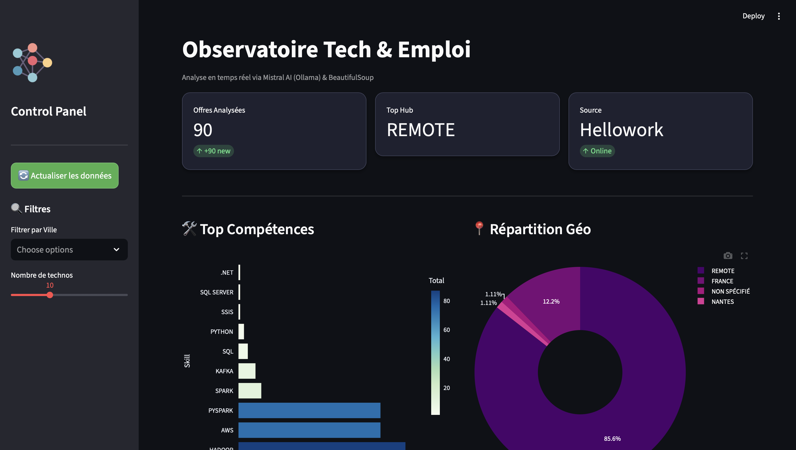

# Data Market Pulse : L'Observatoire IA du Marché Data Engineer

**Ne devinez plus les compétences de demain, mesurez-les.** 🚀

Ce projet est un outil d'intelligence du marché qui transforme des milliers d'offres d'emploi "sauvages" en un tableau de bord stratégique. Il permet d'identifier en temps réel les technos les plus demandées et les hubs géographiques les plus actifs pour les Data Engineers.

---

## 💻 Aperçu du Dashboard

*Figure 1 : Interface moderne avec filtres dynamiques, KPI cards et répartition géographique.*

---

## 🛠️ Comment ça fonctionne ? (L'Architecture Data)

Le projet est conçu comme un pipeline ELT (Extract, Load, Transform) moderne, entièrement conteneurisé et local.

### 1. Acquisition (Scraping)
- **Outil :** Python & BeautifulSoup
- **Source :** Hellowork (Data Engineer France)
- **Technique :** Pagination automatique & respect du `robots.txt`.

### 2. Enrichissement sémantique par IA locale
- **Moteur :** Ollama
- **Modèle :** Mistral 7B (Générative AI Française 🇫🇷)
- **Rôle :** Extraction structurée des Hard Skills et de la localisation via un prompt optimisé.

### 3. Restitution (Data Viz)
- **Outil :** Streamlit & Plotly
- **Fonctionnalités :** Dashboard interactif, filtres par ville et mise en cache des données.

---

## Auteur

**Créptus-Jacob GONDJE-DACKA**
* Étudiant en Informatique @ Polytech Nantes
- **LinkedIn**: [Profil professionnel](https://www.linkedin.com/in/créptus-jacob-gondje)

---
*Projet réalisé dans le cadre d'une montée en compétence sur l'Ingénierie Data & les LLM locaux.*
